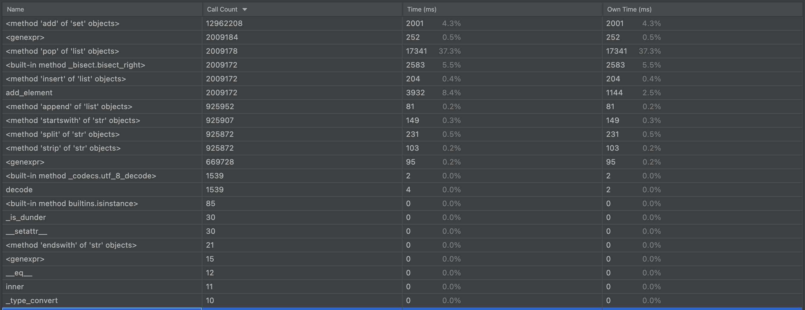

# Exercise 5

Using the profiler (`cProfiler`) identify the incorrect data structure in `code/profiler_exercise/dijkstra.py`.
Find the appropriate data structure in the python standard library.

-----

After running `cProfiler` in PyCharm we get the results below. 
(one-year free Professional PyCharm with built-in profiler is available for students) 



We see that using the method `pop` of `list` object is a bottleneck.

We can see the source of the problem in line 113 in the `dijkstra.py`. 
(Lines 109-113 are pasted below)

```python
que = [(0, start)]
    count = 0
    while que:
        count += 1
        dist, vertex = que.pop(0)
```

My *guess* based on the name of the relevant variable (`que`) is that the correct
data structure to replace `list` is `queue`. 

Perhaps we could also try replacing `list` with `set` but we'd have to verify
that the objects now included in `list` are all unique.

In the [official Python docs](https://docs.python.org/3/tutorial/datastructures.html#using-lists-as-queues)
we read that, when using lists as queues, "doing inserts or pops from the beginning of a 
list is slow (because all of the other elements have to be shifted by one)." And that's exactly what's happening in the
`dijkstra.py` program. The official docs suggest using `collections.deque` instead.

